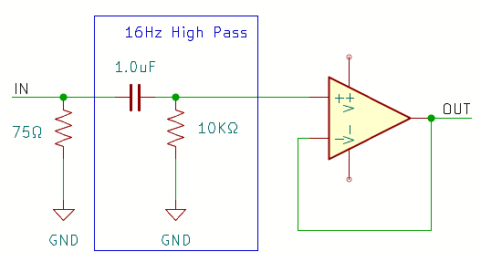
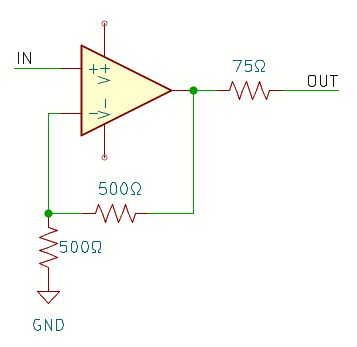
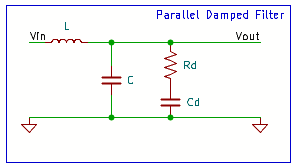
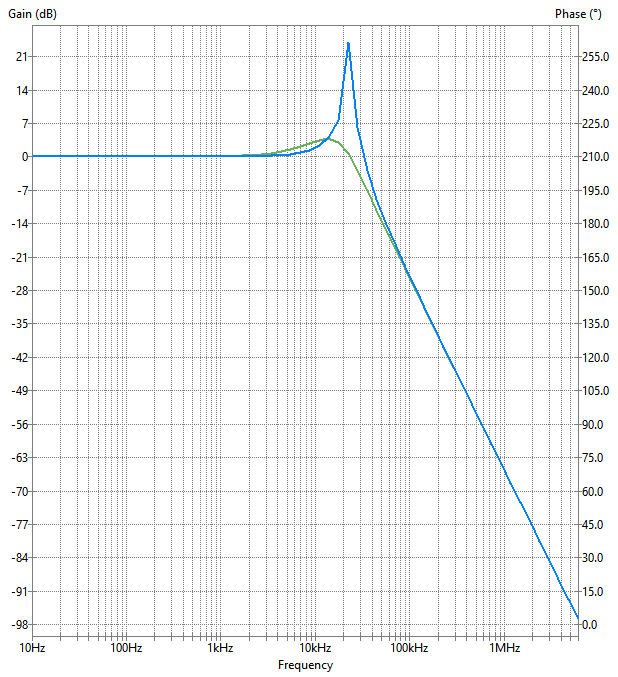

# 6-Input Component+composite Video Switcher
The motivation for this project is to connect 5 retro game consoles to a TV (plus 1 spare for future expansion). The commercially available switches either lack sufficient inputs, or are prohibitively expensive.

The switch will support both component and composite video to provide some flexibility. All of the consoles support composite video. Most of them support component video, though I don't own all the required cables yet. Some (eg. N64 Pal) require a mod to support component video output. Some (eg. PS2) may need a composite connection to enable the the component output.

## Design
For aesthetic and cable management reasons I wan all the RCA connectors to be at rear of the unit. The front of the unit will have a selector button plus a display to indicate which input is selected. The display will also show auto scanning status, assuming I end up implementing such a feature.

The longest side of the PCB should be 200mm or less. This is to allow 3d printing a case using common 3d printers - my own 3D printer has a build volume of 220x220x250mm.

To allow 6 inputs within the above constraints I've chosen a stacked layout of 2 PCBs, with 3 inputs on the top PCB, and 3 inputs + 1 outputs on the lower PCB. Ideally both PCBs will have the same design and differ only in the placed components.

## Input Stage

The input stage consists of:
- 75Ω termination
- A high-pass RC filter to block DC signals
- A signal buffer to drive the signal through the relatively high-impedence switching stage. Implemented via a unity-gain opamp wired as a voltage follower.

The output from the input stage is series-terminated at the source.

The opamp device chosen is the [Runic Technology RS8754XP](https://en.run-ic.com/upload/goods/20240403/202404031600189337.pdf) quad rail-to-rail opamp.
- Unity-gain stable
- High gain-bandwidth of 250MHz
- Low-price
- Readily available

## Switching Stage
The goal of the project is to connect a mix of 480p/576p consoles and a 720p/1080i console (Xbox original). The bandwidth required to pass a 720p or 1080i signal guides the choice of multiplexer IC.

[Analog Devices AN-944 "Signal Bandwidth vs. Resolution for Analog Video"](https://www.analog.com/media/en/technical-documentation/application-notes/7378546an_944.pdf) specifies 37.13MHz bandwidth is needed for 1080i.

Multiplexer IC bandwidth is often specified at a -3dB level, so looking for at a device that supports at least 50Mhz will be required for a good picture. 

A search for applicable parts comes up with 2 categories:
- Cheap ICs with a high _Ron_ impedence
- ICs with a low _Ron_ impedence which cost much more

I've selected the cheap + high impedence path with a buffered input stage to deal with it.

The multiplexer device chosen in the 74HC4052D. This is a 4:2 2-channel multiplexer. The inputs of the top PCB will pass through the multiplexer twice - once on the top PCB, and a second time on the lower PCB. This simplifies the PCB layout compared to a 8:1 device (74HCT4051D)
- Multiple sources and readily available
- 170MHz -3dB bandwidth
- The `HC` version supports a lower Vcc voltage compared to the `HCT` version. This eliminates the need for a +5V supply rail.

## Output Stage

The output signal is buffered via a 2:1 gain voltage follower to a 75Ω output impedence for connection to a coax cable with 75Ω characteristic impedence. The 2x gain is required as the 75Ω terminting resistor to ground (within the television) forms a voltage divider with the resistor at the output of the opamp.

_actually, the gain is a little higher than 2:1 to account for losses_

## Display
The display will be a common 128x32 0.91" OLED panel, based on the SSD1306 Driver IC. Communication is over i2c. Such panels are available very cheap on aliexpress and elsewhere, and they look great. The display requires up to 25mA at 5V.

## Microcontroller
There's not much processing required in the project, so the goal here was to use something easy to program and flash. An Arduino Nano is trivial to flash over USB, includes libraries for outputting to the display, and the clone versions are readily available and cheap.

## Power Requirements
The device will be powered by a DC Barrel Jack of the most common size, 5.5mm outer diameter, 2.1mm inner diameter, center positive. The input will be nominally 9V DC, though it should accept between 7-12V DC (based on Arduino Nano input).

The Arduino Nano can be powered from an unregulated 7V-12V input. The Arduino Nano includes a linear 5V regulator. I've chosen to limit use of this to powering the display as it's unknown how much power can be pulled via on the cheap clone versions.

| Device | Purpose | Device Count | Arduino +5V | -2.5V | +2.5V |
| -- | -- | -- | -- | -- | -- |
| OLED Display | | 1 | 25mA
| 74HC4052D 4:1 2-channel Multiplexer | Supply Current | [6](## "3 on each the upper and lower PCB") | | [120mA](## "20mA per device") | [300mA](## "50mA per device") |
| RS8754XP Quad Opamp | Quiescent current | [14](## "2 per input + 2 for output") | | [196mA](## "3.5mA per amplifier, 14mA per device")| 196ma
| | Output current - Input to Switching stage | 12 | |[0.1mA](## "6 channels * 1V signal / (50kΩ) * 1.2 efficiency")| 0.1mA
| | Output current - RCA Out | 2 | |[96mA](## "6 channels * 2V signal / (75Ω * 2) * 1.2 efficiency")| 96mA
| | Output current - Microcontroller ADC (Luma/Y & composite only) | 2 | |TODO | TODO. Use Summation Amplifier mode
| Total | | | 25mA | 412mA | 592.1mA
| Power | | | 0.125W | 1.03W | 1.48W

| | |
| ------------------- | ----- |
| Total Power         | 2.64W |
| Current @ 7V input  | 377mA |
| PTC Resettable Fuse | 500mA |

## Power Supplies

The intention is to 3d-print a case, which means switching power supplies is preferred for lower heat. A linear regulator with heatsink may work fine at 80°C but risks softening/deforming the surrounding case, especially if it's printed from PLA.

The `Power Supply Rejection Ratio` of Opamps is generally very good at lower frequencies, but poor at higher frequencies. The same generalisation applies to linear regulators. There is no point in using a linear regulator after the switching regulator, since in either case a low-pass filter is required to remove high-frequency noise.

A combination of a switching buck regulator (TPS561243DRLR) and low-pass filters [on both input and output sides](https://www.analog.com/en/resources/technical-articles/switching-regulator-noise-reduction-with-an-lc-filter.html) will be used to create a clean +2.5V source.

Generating a -2.5V supply can be done easily with either a charge pump or Cuk converter. The limit for most negative charge pumps is only 200mA, so a Cuk converter will be used (LM2611AMFX/NOPB). As for the +2.5V supply, an additional LC filter stage will be used both before and after the regulator to reduce high frequency noise.

I've discounted a single split-rail buck converter as it may struggle to maintain regulation with light loads and different loads on each rail.

## Power Supply Filtering
The RS8754XP has a typical PSRR of 90dB, though it's unclear what frequency that is measured at - possibly only at 100Hz. The low-pass filters should be at a sufficiently low cut-off frequency that we can assume the PSRR of the opamp at unfiltered frequencies will be good enough.

[TI SNVA538](https://www.ti.com/lit/an/snva538/snva538.pdf) "Input Filter Design for Switching Power Supplies" shows how a damped-filter can be implemented. I've chosen the simpler parallel damped design presented in the article, mostly because the maths for the two-stage filter is too hard.

An LC Filter has a peak at the resonant frequency:
$`f_{0} = \frac{1}{2 \pi \sqrt{L \times C}}`$

Optimum damping resistance value:
$`R_{d} = \sqrt{\frac{L}{C}}`$ where $`C_{d} = 4C`$

For a LC filter with $`L = 3.3\mu H`$ and $`C = 22 \mu F`$, the damping values are:

$`f_{0} = \frac{1}{2 \pi \sqrt{L \times C}} = \frac{1}{2 \pi \sqrt{3.3\mu H \times 22\mu F}} = 18.68\text{kHz}`$

$`R_{d} = \sqrt{\frac{3.3\mu H}{22\mu F}} = 387mΩ`$

$`C_{d} = {4}\times{22\mu F} = 88\mu F`$

This is a plot of the simulation in SPICE (via Kicad), comparing the plain LC filter (green) vs the damped filter (blue) using the component values above:

Playing around with the values, better results are obtained from a larger inductor (with Rd resized to suit). The Cuk switch will use a much larger 10uH inductor, and using this for the filter results in 9.5dB lower noise at 1MHz compared to 3.3uF.

## Cuk converter design
Part: LM2611AMFX/NOPB. The design steps below follow the _Detailed Design Procedure_ of the part datasheet.

### Duty Cycle:

$`V_{out} = -V_{in} \frac{D}{1-D}`$

$`D = -\frac{V_{out}}{-V_{out}+V_{in}}`$

At 9V, $`D = -\frac{-2.5}{2.5+9} = 0.217`$

At 12V, $`D = -\frac{-2.5}{2.5+12} = 0.172`$

_Note: Maximum duty cycle of LM2611 is 82% over the temperature range._

### Inductor Ripple
The data sheet suggests an inductor in the 10-22uH range. Assuming an average current of 300mA, the ripple current using 22uH inductors was too low (10%), and 10uH seems ok (23%) (recommendation = under 30%).

$`\Delta i_{L} = \frac{V_{in} \times D \times T_{s}}{2 \times L} \text { where } D = \text {duty cycle and } T_{s} = \frac {1}{f_{s}} = \frac {1}{1,400,000}`$

At 9V, $`\Delta i_{L} = \frac{9 \times 0.217 \times 0.000000714}{2 \times 0.000010} = 69.7mA`$

At 12V, $`\Delta i_{L} = \frac{12 \times 0.172 \times 0.000000714}{2 \times 0.000010} = 73.7mA`$

Assuming an average current of 300mA, the ripple current will be between 23% & 24.5%, which is under the 30% limit recommended by the datasheet.

$`i_{SW(PEAK)} = I_{out} \times (1 + \frac{D}{1 - D})+\frac {V_{in} \times D \times T_{s}} {2} \times (\frac {1}{L_{1}} + \frac {1}{L_{2}})`$

$`i_{SW(PEAK)} = 0.412 \times (1 + \frac{0.217}{1 - 0.217})+\frac {9 \times 0.217 \times 0.000000714} {2} \times (\frac {1}{0.000010} + \frac {1}{0.000010}) = 666mA`$

Based on these values, I've chosen Taiyo Yuden NRS6045T100MMGK 10uH inductor for high current ratings (2.4A), and low dc resistance (59.8mOhm).

### Feedback Resistors
LM26211 uses a 1.23V reference voltage.

$`1.23V = 2.5 \times \frac {R_{fb2}}{(R_{fb1} + R_{fb2})}`$

Assuming $`R_{fb2} = 10k, R_{fb1} = 10325.20`$ (or 10k + 324Ω using standard resistor values)

$`\frac {1.23 \times {(10324 + 10000)}}{10000} = 2.499852V`$

## Buck Converter Design
Part: TPS561243DRLR

### Feedback Resistors
TPS561243 uses a 0.6V reference voltage.

$`2.5V = 0.6 \times (1 + \frac {R_{fbt}}{R_{rbb}})`$

Assuming $`R_{rbb} = 10k, R_{fbt} = 31666`$ (or 31.6k using standard resistor values)

$`\frac {0.6 \times {(31600 + 10000)}}{10000} = 2.496V`$

## Inductor Ripple
Peak-to-peak ripple current:

$`I_{P-P} = \frac{V_{out}}{V_{in(max)}} \times \frac{V_{in(max)} - V_{out}}{L_{out}\times f_{sw}} = \frac{2.5}{12} \times \frac{12 - 2.5}{2.2uH \times 1,280,000} = 703mA`$

Max current:
$`I_{peak} = I_{out} + \frac {I_{P-P}}{2} = 0.5921 + \frac {0.703}{2} = 944mA`$

Based on these values, I've chosen Taiyo Yuden NRS4018T2R2MDGJ, with 2.2A current rating, 3A saturation, and low 50.4mΩ DCR.